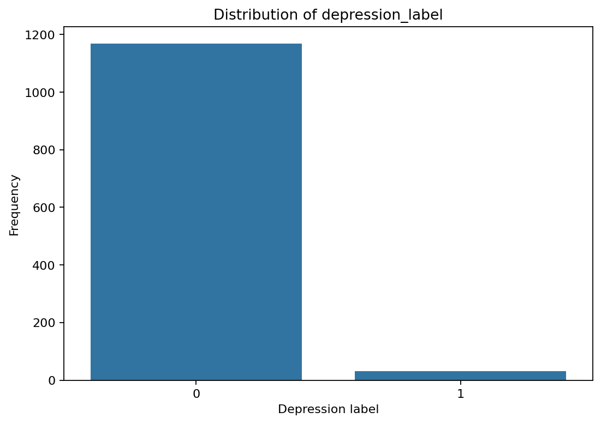
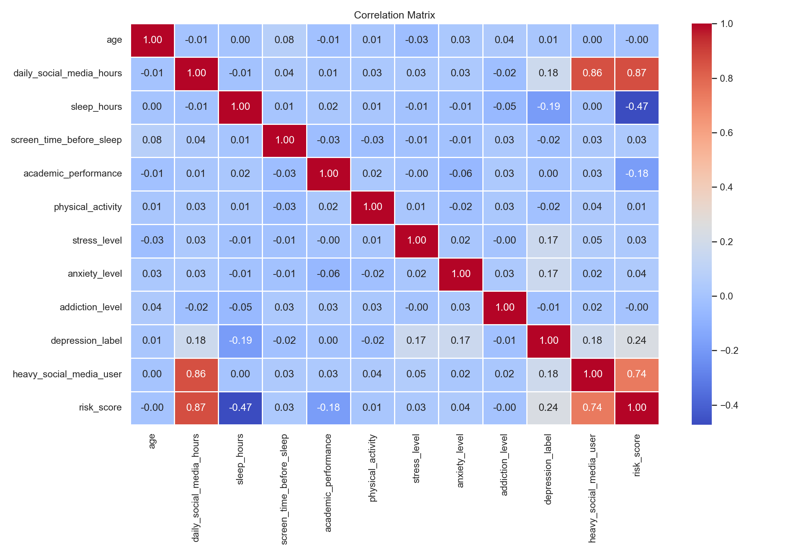
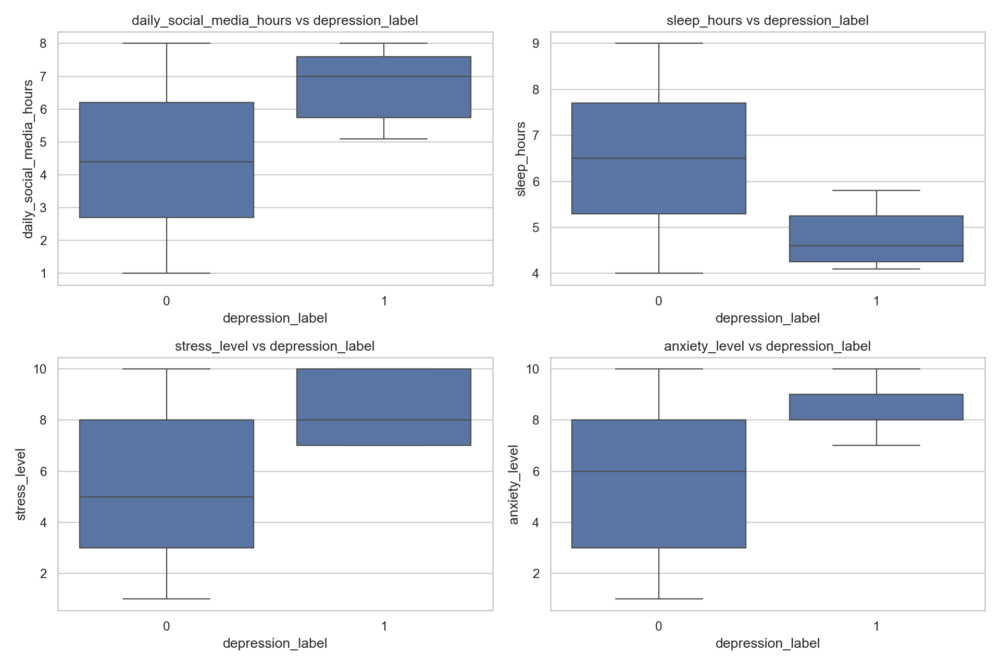

# Teen Mental Health EDA

Proyecto de analisis exploratorio de datos sobre habitos digitales, descanso, actividad fisica y salud mental en adolescentes.

## Objetivo

El objetivo es estudiar patrones asociados a la variable `depression_label`, prestando atencion a:

- Uso diario de redes sociales.
- Horas de sueno y uso de pantallas antes de dormir.
- Nivel de estres, ansiedad y adiccion.
- Rendimiento academico y actividad fisica.
- Diferencias por variables categoricas como genero, plataforma y nivel de interaccion social.

## Estructura del proyecto

```text
proyecto-github-01/
|-- data/
|   |-- raw/
|   |   `-- Teen_Mental_Health_Dataset.csv
|   `-- processed/
|       `-- teen_mental_health_processed.csv
|-- notebooks/
|   |-- 01_teen_mental_health_eda.ipynb
|   `-- 01_teen_mental_health_eda_original_copy.ipynb
|-- reports/
|   `-- figures/
|       |-- 01_target_distribution.png
|       |-- 02_numeric_distributions.png
|       |-- 03_correlation_matrix.png
|       |-- 04_numeric_vs_depression_label.png
|       |-- 05_depression_rate_by_category.png
|       `-- 06_cramers_v_by_category.png
|-- src/
|   |-- cleaning.py
|   |-- features.py
|   |-- io.py
|   |-- utils.py
|   `-- viz.py
|-- main.py
|-- requirements.txt
`-- README.md
```

## Instalacion

Desde la raiz del proyecto:

```bash
python3 -m venv .venv
source .venv/bin/activate
pip install -r requirements.txt
```

## Ejecucion

Para generar el dataset procesado:

```bash
python main.py
```

El archivo resultante se guarda en:

```text
data/processed/teen_mental_health_processed.csv
```

## Ruta recomendada de revision

Para revisar el proyecto en GitHub, el orden recomendado es:

1. Leer este `README.md` para entender el objetivo, la estructura y las conclusiones principales.
2. Abrir `notebooks/01_teen_mental_health_eda.ipynb` para revisar el EDA completo, con codigo, tablas, graficas y conclusiones.
3. Consultar `reports/figures/` para ver las visualizaciones principales exportadas como imagenes.
4. Revisar `src/` para comprobar que la limpieza, el feature engineering y las utilidades estan modularizadas.
5. Ejecutar `python main.py` para regenerar el dataset procesado desde `data/raw/`.

## Notebook principal

El analisis limpio y presentable esta en:

```text
notebooks/01_teen_mental_health_eda.ipynb
```

La version previa se conserva como copia de respaldo en:

```text
notebooks/01_teen_mental_health_eda_original_copy.ipynb
```

Incluye:

- Carga y validacion inicial del dataset.
- Limpieza de datos y conversion de tipos.
- Feature engineering.
- Analisis descriptivo.
- Distribuciones y correlaciones.
- Comparacion de variables frente a `depression_label`.
- Pruebas chi-cuadrado y Cramer's V para variables categoricas.
- Interpretacion de resultados despues de las validaciones y graficas principales.

## Como queda documentado el EDA

El EDA queda documentado en tres niveles:

- `README.md`: resumen ejecutivo del proyecto, instrucciones de ejecucion y principales conclusiones.
- `notebooks/01_teen_mental_health_eda.ipynb`: analisis paso a paso, con codigo reproducible y outputs guardados.
- `reports/figures/`: graficas exportadas para facilitar la revision sin ejecutar el notebook.

## Visualizaciones

Las principales graficas del analisis se guardan tambien como imagenes en `reports/figures/`.







## Principales conclusiones iniciales

- El dataset contiene 1200 registros y no presenta nulos ni duplicados en la version original revisada.
- La variable `depression_label` esta muy desbalanceada: aproximadamente un 2.6% de registros positivos.
- Las correlaciones lineales mas destacadas con `depression_label` son positivas para horas diarias en redes sociales, estres y ansiedad, y negativa para horas de sueno.
- En las variables categoricas analizadas, las pruebas chi-cuadrado no muestran una asociacion fuerte con `depression_label` en esta muestra.

## Nota

Este EDA es exploratorio. Las asociaciones observadas no implican causalidad y conviene interpretar los resultados teniendo en cuenta el desbalance de la variable objetivo.
